# Zotero下载安装及题录导入[^3] {#ch:install}

## Zotero的安装

[Zotero](https://www.zotero.org/)原来是基于Firefox浏览器的一个插件，现在有基于桌面的独立安装版。[Zotero](https://www.zotero.org/)支持现在常见的操作系统， 如Windows、Linux及MacOS。 可以到<https://www.zotero.org/download/>去下载相应操作系统及位数的安装包。 这里以Windowns 10 64位版本的安装文件为例进行说明。

1.  双击下载的安装文件，如Zotero-x.x.x_setup.exe(x为具体的版本号，[\[fig:package\]](#fig:package){reference-type="autoref" reference="fig:package"})， 首先会显示正在解压的界面，如[\[fig:extracting\]](#fig:extracting){reference-type="autoref" reference="fig:extracting"}所示， 如果出现用户帐户控制，点击，如[\[fig:userControl\]](#fig:userControl){reference-type="autoref" reference="fig:userControl"}：

    {#fig:extracting width="0.3\\linewidth"}

    {#fig:extracting}

2.  然后出现安装向导，如[\[fig:installwiz1\]](#fig:installwiz1){reference-type="autoref" reference="fig:installwiz1"}所示，。

    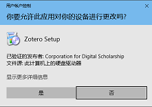{#fig:installwiz1}

    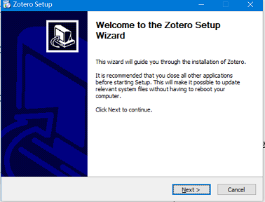{#fig:installwiz1}

3.  接下来选择安装类型，如[\[fig:installType\]](#fig:installType){reference-type="autoref" reference="fig:installType"}, 一般选择Standard(标准)就可以，如果有兴趣也可以选择Custom(定制)， 选择Custom在点下一步会提示可以修改安装目录 (默认安装目录为 )以及是否在桌面上及 开始菜单的程序组中放置图标。

4.  选择Standard后提示安装目录为， 此处无法修改安装目录， 如[\[fig:ch1StartInstall\]](#fig:ch1StartInstall){reference-type="autoref" reference="fig:ch1StartInstall"}。如果要修改需要在上一步选择Custom选项。

5.  此时信息已经收集完毕，点击(安装)就开始安装了，如[\[fig:ch1Installing\]](#fig:ch1Installing){reference-type="autoref" reference="fig:ch1Installing"}。

6.  最后安装完成，点击(完成)就可以打开Zotero，如[\[fig:ch1InstallComplete\]](#fig:ch1InstallComplete){reference-type="autoref" reference="fig:ch1InstallComplete"}所示。

7.  也可以 [下载Zip格式](https://www.zotero.org/download/client/dl?channel=release&platform=win32-zip)， 解压后直接使用。或从<https://github.com/pedrom34/ZoteroPortable>下载便携格式， 下载的方法是在页面上点击绿色的按钮， 再点击，下载完毕后解压，运行ZoteroPortable.exe即可打开Zotero，使用也十分方便，甚至可以解压到U盘， 做到真正的便携。使用便携版的另一外好处是Zotero的配置文件和数据文件都在这个文件夹中，如果不放在系统盘， 重装系统时不用再重装Zotero，直接双击ZoteroPortable.exe即可继续使用，便携版的安装及使用详见 [Zotero便携版的安装与使用 <https://zhuanlan.zhihu.com/p/350797263>](https://zhuanlan.zhihu.com/p/350797263)。

{#fig:ch1StartInstall}

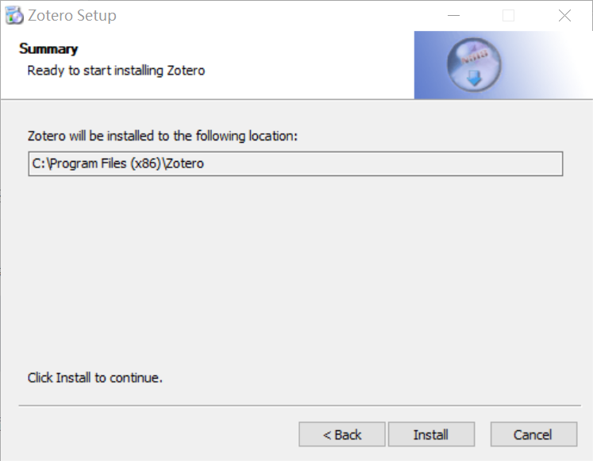{#fig:ch1StartInstall}

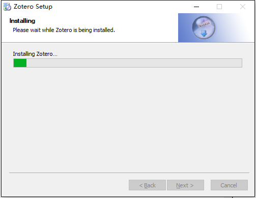{#fig:ch1InstallComplete}

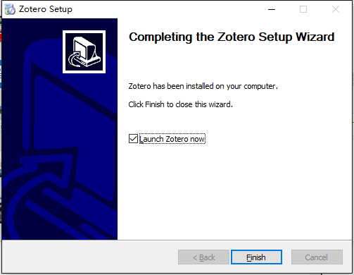{#fig:ch1InstallComplete}

## 浏览器插件的安装

要想快速的导入文献，最好装上Zotero的浏览器插件。 Zotero针对不同的浏览器(Chrome、Firefox、Safari和最新的Chromium内核的Edge,不支持IE浏览器) 有不同的插件。 在这里推荐比较好用的Chrome内核浏览器： CentBrowser(百分浏览器)，可以到<http://www.centbrowser.cn/history.html> 根据自己的操作系统位数，下载安装版或便携版。

在访问[Zotero浏览器插件安装网站https://www.zotero.org/download/](https://www.zotero.org/download/)时， 网站会检测当前所用浏览器内核，提示安装相应插件， 如[\[fig:ch1PluginWeb\]](#fig:ch1PluginWeb){reference-type="autoref" reference="fig:ch1PluginWeb"}所示。可以直接点击， 然后出现是否需要安装的提示，如[\[fig:ch1PluginInstall\]](#fig:ch1PluginInstall){reference-type="autoref" reference="fig:ch1PluginInstall"}, 点击进行插件安装。插件的安装过程有可能需要翻墙， 成功安装后会在合适的位置根据当前网页的类型显示不同图标， 一般网页的图标如[\[fig:ch1ZoteroIcon\]](#fig:ch1ZoteroIcon){reference-type="autoref" reference="fig:ch1ZoteroIcon"}显示,如果没有打开网站， 则会显示一个灰色的"Z"。

如果无法安装，可以到<https://pan.baidu.com/s/1SRsAKk6XV8z8ImGueocPNQ>下载针对Chrome内核的插件进行离线安装。

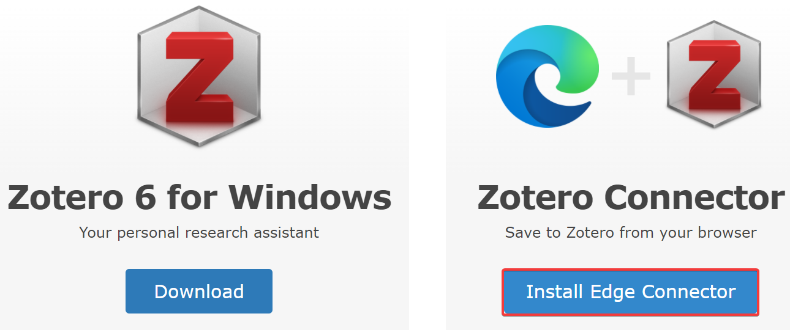{#fig:ch1PluginWeb width="0.6\\linewidth"}

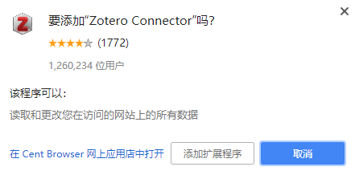{#fig:ch1PluginInstall width="0.6\\linewidth"}

{#fig:ch1ZoteroIcon width="0.8\\linewidth"}

下载后离线安装的方法是，以百分浏览器为例， 将下载的zotero_connector_x.crx(x为版本号)拖入百分浏览器， 而后浏览器的提示与[\[fig:ch1PluginInstall\]](#fig:ch1PluginInstall){reference-type="autoref" reference="fig:ch1PluginInstall"}类似， 如[\[fig:ch1PluginInstall2\]](#fig:ch1PluginInstall2){reference-type="autoref" reference="fig:ch1PluginInstall2"}。

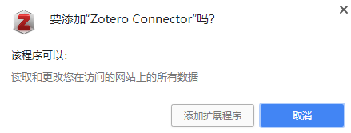{#fig:ch1PluginInstall2 width="0.7\\linewidth"}

Google 的 Chrome 浏览器宣布从最新Chrome版本开始默认只允许从 Chrome Web Store 下载安装扩展程序，网上有一些解决办法，但我没有试成功。 所以只能翻墙在Chrome的应用商店上下载或是使用修改版的Chrome。

## 建立自己的Zotero文献库 {#sec:newLibrary}

### 设置文献库在硬盘上的位置

1.  建立自己的Zotero文献库首先需要选择自己的将要建立文献库在硬盘上的位置， 方法是在Zotero中依次点击， 如[\[fig:ch1ZoteroPre1\]](#fig:ch1ZoteroPre1){reference-type="autoref" reference="fig:ch1ZoteroPre1"}所示。

    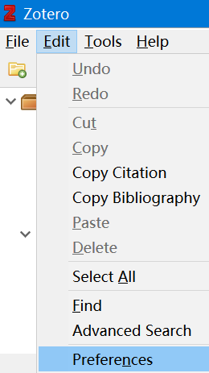{#fig:ch1ZoteroPre1}

2.  在弹出的Zotero Preferences对话框中，依次点击， 设置Base directory为我们存放全文文件夹。 文献库在Zotero中默认的存贮位置为, 最好我们不要将这些数据不要存放在系统盘，防止系统崩溃造成无法挽回的损失。 我们可以将这个目录改为自己的文件夹，如[\[fig:ch3BaseDir\]](#fig:ch3BaseDir){reference-type="autoref" reference="fig:ch3BaseDir"}所示

    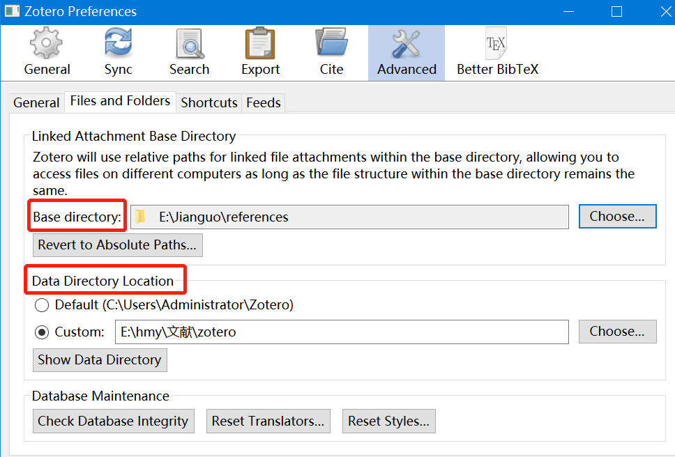{#fig:ch3BaseDir width="0.8\\linewidth"}

3.  []{#sec:creat_folder label="sec:creat_folder"} 设置完文献存贮位置后，最好还要在Zotero中根据自己的课题方向或文献的类型等建立不同的分类(文件夹)， 方便对文献进行分类管理。 建立分类(文件夹)的方法是在Zotero中依次点击， 如[\[fig:ch1ZoteroNewColl1\]](#fig:ch1ZoteroNewColl1){reference-type="autoref" reference="fig:ch1ZoteroNewColl1"}所示，或是在Zotero左侧的上右击， 选择， 在弹出的对话框中输入自己的分类名称，如[\[fig:ch1ZoteroNewColl2\]](#fig:ch1ZoteroNewColl2){reference-type="autoref" reference="fig:ch1ZoteroNewColl2"}所示。

    {#fig:ch1ZoteroNewColl2}

    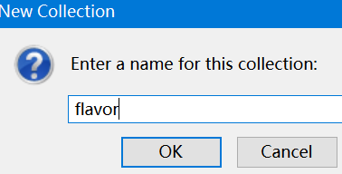{#fig:ch1ZoteroNewColl2}

4.  然后就会看到Zotero左侧面板中出现了刚才新建的分类， 如[\[fig:ch1ZoteroNewColl3\]](#fig:ch1ZoteroNewColl3){reference-type="autoref" reference="fig:ch1ZoteroNewColl3"}所示，可以通过此方法建立多个分类， 而且可以通过在分类上右击，选择在分类下面再建立子分类， 如[\[fig:ch1ZoteroNewColl4\]](#fig:ch1ZoteroNewColl4){reference-type="autoref" reference="fig:ch1ZoteroNewColl4"}所示[^4]， 如果建立了多个分类（文件夹），在搜索文献结果中如果知道文献属于哪个或哪些文件夹呢？ Windows操作系统中，用鼠标点击选中文献后，按住，文献所属的（分类）文件夹就会高亮显示。 其他操作系统的按钮为： (macOS), 或 (Linux)，详见 [Zotero官方文档](https://www.zotero.org/support/collections_and_tags#identifying_collections_an_item_is_in)。

    {#fig:ch1ZoteroNewColl4}

    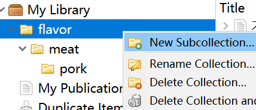{#fig:ch1ZoteroNewColl4}

### 从网站导入题录及全文 {#sec:ImportFromWeb}

有很多方式可以在Zotero库中添加文献条目，最方便的还是直接在网上数据库进行导入， 安装浏览器插件(扩展)的目的也正是为此。 浏览器上Zotero的图标会根据当前打开网页的文献类型而显示不同的图标， 默认如[\[fig:ch1ZoteroIcon\]](#fig:ch1ZoteroIcon){reference-type="autoref" reference="fig:ch1ZoteroIcon"}显示, 当前网页含有多条文献时显示为文件夹图标，如果是学位论文则显示学位帽图标。 Zotero的这种自动感知功能十分强大， 期刊的网页我目前还没有碰到过不能感知的。实际上自动感知所支持的网页还有Amazon，Nytimes等， 而且Zotero支持的网页数目还在持续增长。 Zotero支持现在常见的网络数据库，如Sciencedirect、Springer及PubMed文献数据库等。我们仅以SD数据库、 中国知网CNKI和Google Scholar为例看一下。

#### Science Direct文献导入

完全打开某篇文章网页，鼠标指向Zotero在浏览器中的图标时， 会提示：, 如[\[fig:ch1SDImport\]](#fig:ch1SDImport){reference-type="autoref" reference="fig:ch1SDImport"}。 一般括号中会显示当前文献所属的数据库或期刊名称。 此时，点击这个图标，这篇文献就会导入到Zotero库中，如[\[fig:ch1SDRef\]](#fig:ch1SDRef){reference-type="autoref" reference="fig:ch1SDRef"}。 比较吸引人的是，如果有这个数据库(期刊)的权限， 这个篇对应的PDF会同时下载下来，而且链接到这篇文献，在Zotero文献库中双击这个条目， 则系统会自动调用PDF阅读器打开这篇文献， 是不是很方便[^5]？ 如果打开文献网页时鼠标指向Zotero在浏览器中的图标时提示 ， 原因是网页还没有完全打开，稍等一会儿或是刷新网页等显示正常了再导入。

{#fig:ch1SDImport width="0.7\\linewidth"}

{#fig:ch1SDRef width="0.7\\linewidth"}

#### 中国知网文献导入 {#sec:cnki}

在中国知网主页<http://www.cnki.net/>搜索结果中点击具体的文献， 打开文献的页面，此时鼠标移向Zotero在浏览器中的图标时，提示, 如[\[fig:ch1CNKIImport\]](#fig:ch1CNKIImport){reference-type="autoref" reference="fig:ch1CNKIImport"},点击这个图标，对应的文献就会导入到Zotero库中，但遗憾的是即使有权限， 对应的全文CAJ或PDF都不会一起导入[^6]。如果<http://www.cnki.net/> 这个网站不好用，可以试试<http://epub.cnki.net/kns/default.htm>。

如果你在中国知网检索文献时发现题录无法识别（识别为网页），请确认你是否是在校外通过 VPN登录访问的中国知网， 如果是这种情况，请到 <https://github.com/Zotero-CN/translators_CN>下载新的 [cnki.js](https://github.com/Zotero-CN/translators_CN)并替换电脑上旧的 针对于中国知网的translator [cnki.js](https://github.com/Zotero-CN/translators_CN)，或是通过茉莉花插件来更新 [cnki.js](https://github.com/Zotero-CN/translators_CN)， 详见[5.6](#sec:cnki_fulltext){reference-type="ref" reference="sec:cnki_fulltext"}，或是设置一下浏览器详见 [如何在家愉快地使用Zotero通过远程访问收集知网数据](https://zhuanlan.zhihu.com/p/110731827)。最好的办法是 通过[http://fsso.cnki.net中国知网高校/机构外部访问系统]( http://fsso.cnki.net)选择自己 的学校或机构后，点击，而后输入自己在学校或机构的账号、密码，点击，或许 还需要点击同意一些条款，然后浏览器会重新定向到 [https://www.cnki.net/](www.cnki.net)，使用就和在学校一样了，当然有 些学校或机构可能没有在[https://www.cnki.net/](www.cnki.net)列表上，只能 用上面的其它办法了，在家使用知网也参见 [Zotero CNKI翻译器更新(适合在家使用知网)](https://zhuanlan.zhihu.com/p/351547307)。

{#fig:ch1CNKIImport width="0.7\\linewidth"}

#### 通过Google Scholar导入文献

在Google Scholar搜索结果页面中，Zotero在浏览器中图标会变成一个文件夹图标， 点击这个小图标，在显示的页面中我们可以选择需要的条目，然后点击， 我们选择的条目就会自动导入的Zotero库中。 但是Zotero的浏览器插件不支持Google Scholar的一些镜像网站(如<https://scholar.glgoo.org/>)。

### 通过文献标识符导入题录

如果已知文献的ISBN、DOI、PMID或arXiv ID， 可以通过文献标识符导入到Zotero库中，在Zotero中，点击魔术棒， 输入这些ID，如DOI：10.1016/j.meatsci.2016.03.026， 如[\[fig:DOI\]](#fig:DOI){reference-type="autoref" reference="fig:DOI"}所示，然后按，则对应的文献就会被导入到库中， 注意如用这种方式导入文献也需要保持互联网畅通。

{#fig:DOI width="0.7\\linewidth"}

### 已有PDF文献的导入 {#sec:EngPDFIm}

对于以前下载的PDF文献，Zotero也可以很方便地提取PDF的元 信息(这里PDF的导入是指英文的PDF文件， 中文PDF的导入方式见[5.33](#sec:Chinese_PDF){reference-type="ref" reference="sec:Chinese_PDF"}),同时把此PDF作为附件链接到这篇文献中。 已有PDF文献导入的方式是将PDF直接拖入到Zotero中， 如[\[fig:ch1PDFImport\]](#fig:ch1PDFImport){reference-type="autoref" reference="fig:ch1PDFImport"}所示， Zotero会自动提取该PDF文件元数据(如文章的作者、题目、年代等信息)， 如[\[fig:ch1PDFImport1\]](#fig:ch1PDFImport1){reference-type="autoref" reference="fig:ch1PDFImport1"}所示。

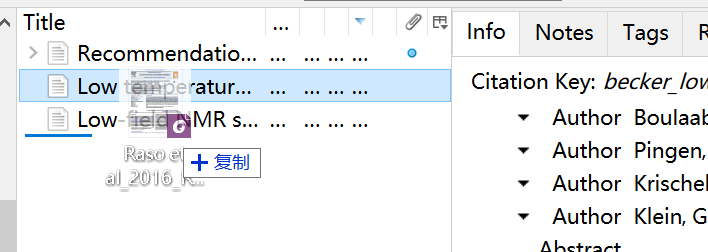{#fig:ch1PDFImport width="0.7\\linewidth"}

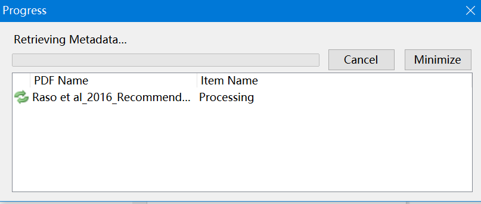{#fig:ch1PDFImport1 width="0.7\\linewidth"}

### 从其他文献管理软件导入 {#OtherRefSoft}

如果以前用其他文献管理软件或是从其他人的Zotero库中导入， Zotero可以方便地导入。首先，从其他文献管理软件导出BibTex、RIS或Zotero RDF格式。 然后，在Zotero中点击， 如[\[fig:ch1ImportFromOther\]](#fig:ch1ImportFromOther){reference-type="autoref" reference="fig:ch1ImportFromOther"}所示 ，根据提示找到导出的文件即可将那些文献导入到Zotero中。

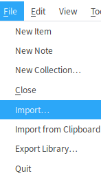{#fig:ch1ManualNew}

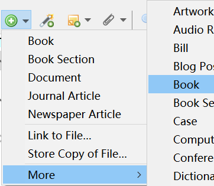{#fig:ch1ManualNew}

### 手动录入题录 {#sec:ManualImport}

对于那些不能从网上找到的文献，如一些老的文献、国家标准、 会议论文等，只能手动录入文献的信息。手动新建文献的方法是： 在Zotero界面中点击图标右边的小箭头， 选择正确的文献类型，如[\[fig:ch1ManualNew\]](#fig:ch1ManualNew){reference-type="autoref" reference="fig:ch1ManualNew"}所示， 然后在Zotero右侧填入文献对应的信息，如：题目、作者、年代等信息， 如[\[fig:ch1ManualNewBook\]](#fig:ch1ManualNewBook){reference-type="autoref" reference="fig:ch1ManualNewBook"}所示。

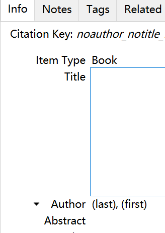{#fig:ch1LinkFile1}

{#fig:ch1LinkFile1}

{#fig:ch1LinkFile2 width="0.7\\linewidth"}

### 链接全文 {#sec:linkFulltex}

对于从其他网站下载的全文或其他附件信息， 我们可以手动链接到参考文献条目中，先选中对应的参考文献条目 ，在Zotero点击回形针图标， 选择， 如[\[fig:ch1LinkFile1\]](#fig:ch1LinkFile1){reference-type="autoref" reference="fig:ch1LinkFile1"}所示，找到相应的附件。 或在条目上右击，选择，如[\[fig:ch1LinkFile2\]](#fig:ch1LinkFile2){reference-type="autoref" reference="fig:ch1LinkFile2"}所示， 后续步骤与前述相同。链接上附件后，原来存的文件可以删除。

### Zotero 6.0修改打开附件（PDF）的阅读器？ {#sec:chang_pdf_browser}

在Zotero 6.0中内置了打开PDF的阅读器，按[1.3.7](#sec:linkFulltex){reference-type="ref" reference="sec:linkFulltex"}链接了全文后， 双击条目或PDF默认情况会调用其内置的PDF阅读器打开附件， 但是在内置的PDF阅读器做的标记、笔记， 用其它PDF阅读器 （如将PDF文件分享给他人后）打开后， 里面的标记、笔记会消失，只能在内置阅读器中 点击另存为其它PDF 或点击时， 再用其它阅读器打开才可以保留标记、笔记， 如果不习惯，可以设置用系统默认的或自定义PDF阅读器。步骤如下：

在Zotero依次点击， 在File Handling下面，点击Open PDFs Using后面的选择框， 点击 即可使用系统默认的PDF阅读器， 也可以点击，找到自定义的其它打开PDF的程序 ，如[\[fig:ch1customPDFBrowser\]](#fig:ch1customPDFBrowser){reference-type="autoref" reference="fig:ch1customPDFBrowser"}所示。

{#fig:ch1customPDFBrowser width="0.8\\linewidth"}

### 删除（合并）重复文献 {#sec:delDup}

从多个不同数据库导入的文献可能会有重复文献，即两个条目完全相同，这时就需要手动删除重复文献。 Zotero允许一个条目同时存在于多个分类（文件夹）中，这种情况不属于重复文献。删除重复文献的方法 是点击Zotero左侧的，检测到的重复文献就会出现中间的面板中， 点击其中一条文献，与之重复的文献就会全部被选中，右侧面板中显示重复文献的情况。选择其中一条 作为主条目，再点击，重复文献就会被删除（合并）， 如[\[fig:ch1MergeDup\]](#fig:ch1MergeDup){reference-type="autoref" reference="fig:ch1MergeDup"}所示。如果删除（合并）多条重复文献，在点击选中条目后，按 或点击选中所有重复文献， 再点击即可，也可以使用JavaScript脚本批量删除（合并）重复文献， 见[5.18](#sec:DelDupBatch){reference-type="ref" reference="sec:DelDupBatch"}。如何选中重复条目中的某条文献见[5.17](#sec:selectDup){reference-type="ref" reference="sec:selectDup"}。

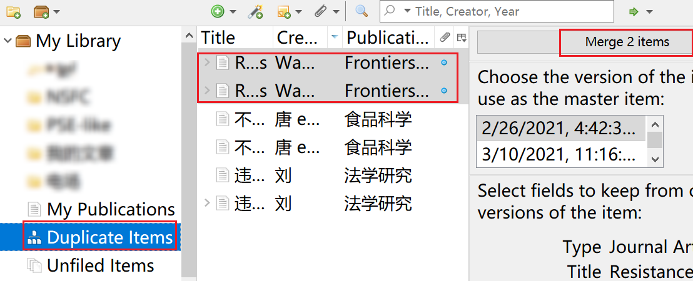{#fig:ch1MergeDup width="0.7\\linewidth"}

