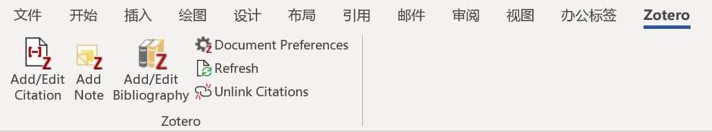
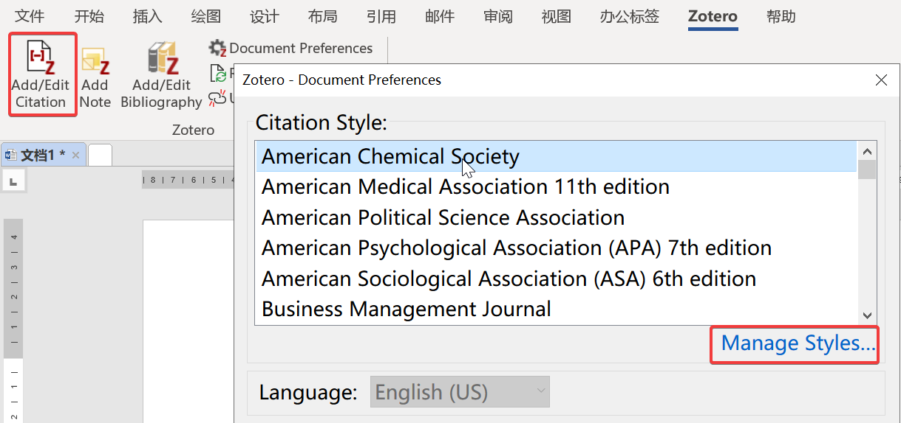
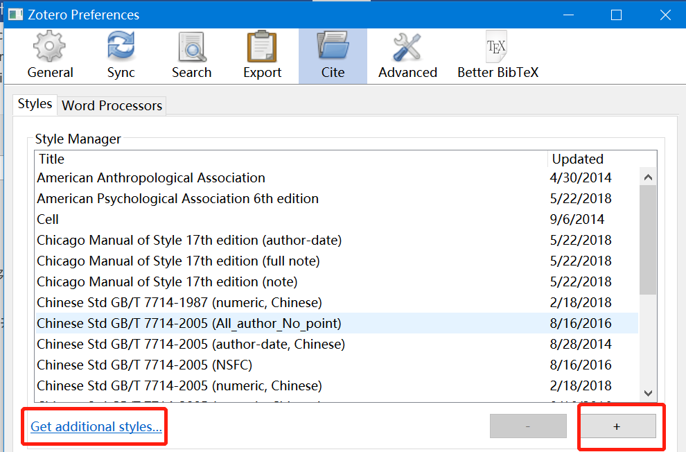
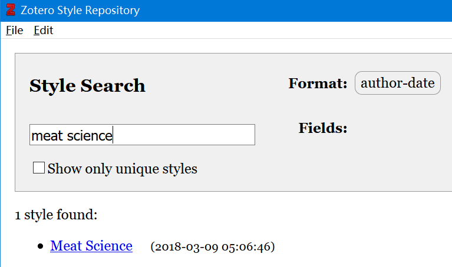
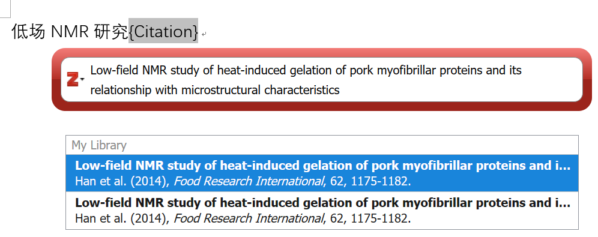
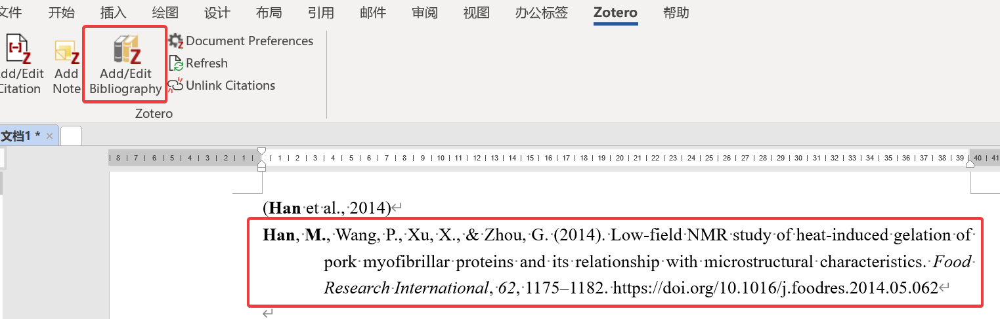
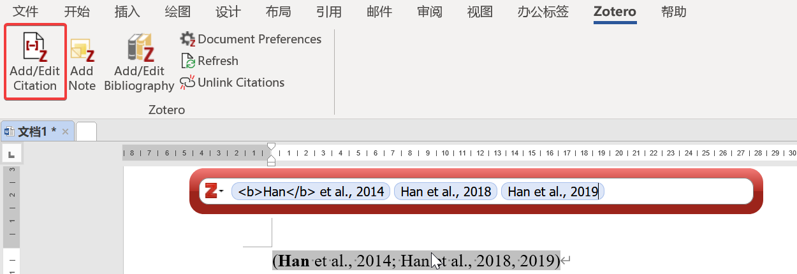
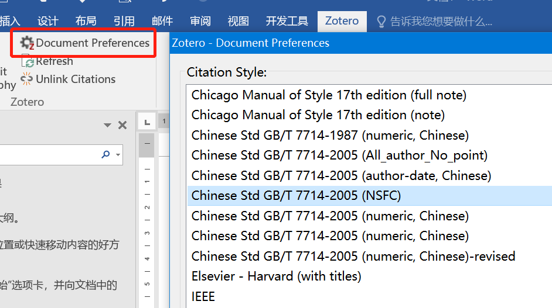
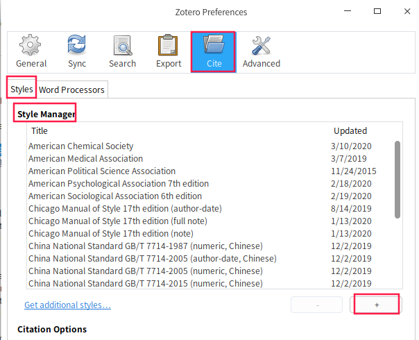
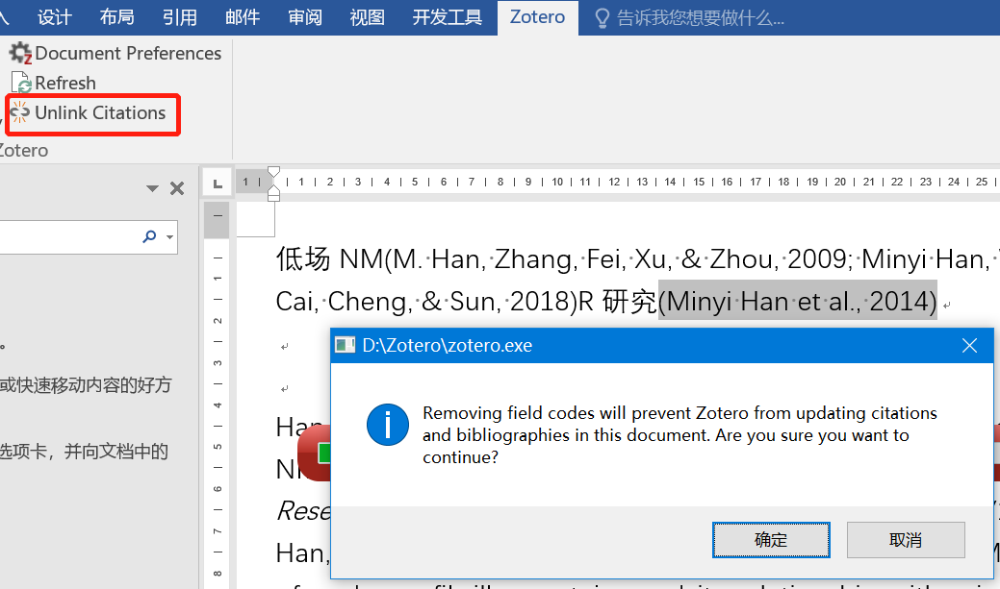

# 在Word中写作时用Zotero插入参考文献 {#ch:insert}

建立了自己的Zotero文献库后， 在写文章尤其是综述类的文章时就可以方便地利用Zotero插入文献了。 现在Zotero对于Libre Office中的Writer和MS Office中的Word支持比较好。 尽管在WPS中会出现Zotero的工具条，但在插入文献时会出现错误。 本文以Word 2016为例进行讲述。如果安装正确的话，在Word中会形成Zotero的工具条， 如[\[fig:ch2ZotoeroTool\]](#fig:ch2ZotoeroTool){reference-type="autoref" reference="fig:ch2ZotoeroTool"}所示， 主要操作在这个工具条中进行。 如果在Word中没有出现Zotero的工具条，可以尝试用见[5.29](#sec:tool_bar){reference-type="ref" reference="sec:tool_bar"}的方法解决。

{#fig:ch2ZotoeroTool}

## 插入参考文献 {#sec:insertRef}

我们在写文章时，尤其是文章的前言或数据的分析讨论部分及在综述类的文章中往往需要插入参考文献， 在Word中插入Zotero管理的参考文献的方法比较简单，步骤如下：

1.  点击Zotero在Word工具条中的第一个按钮， 在弹出的对话框中选择需要的Style(一般是期刊或数据库的名称)， 点击，如[\[fig:ch2WordInsert\]](#fig:ch2WordInsert){reference-type="autoref" reference="fig:ch2WordInsert"}所示。

    {#fig:ch2WordInsert}

2.  如果列表中没有需要的格式[]{#tag:notyle label="tag:notyle"}， 点击[\[fig:ch2WordInsert\]](#fig:ch2WordInsert){reference-type="autoref" reference="fig:ch2WordInsert"}中的， 弹出对话框， 如[\[fig:ch2ZoteroPre\]](#fig:ch2ZoteroPre){reference-type="autoref" reference="fig:ch2ZoteroPre"}所示。

    {#fig:ch2ZoteroPre}

3.  点击[\[fig:ch2ZoteroPre\]](#fig:ch2ZoteroPre){reference-type="autoref" reference="fig:ch2ZoteroPre"}中， 找到需要到的csl文件。 或是点击，则会打开Zotero的Style仓库， 从中搜索我们需要的期刊，如meat science， 在得到的结果点击需要的期刊格式， 这个Style文件就会加入到Zotero Style管理器中，以后可以直接调用， 如[\[fig:ch2ZoteroStyle\]](#fig:ch2ZoteroStyle){reference-type="autoref" reference="fig:ch2ZoteroStyle"}所示, 返回到[\[fig:ch2WordInsert\]](#fig:ch2WordInsert){reference-type="autoref" reference="fig:ch2WordInsert"}，点击。

    {#fig:ch2ZoteroStyle width="0.7\\linewidth"}

4.  接着会出现搜索框，可以在搜索框输入关键词， 如文章的作者，年代，题目等，以个人经验， 输入文章的题目搜索的结果最为准确，点击搜索结果我们希望插入的文献， 如[\[fig:ch2ZoteroSearch\]](#fig:ch2ZoteroSearch){reference-type="autoref" reference="fig:ch2ZoteroSearch"}所示， 然后再按，则选择的文献就会插入到Word中。

    {#fig:ch2ZoteroSearch}

5.  但参考文献现在只是插入到正文中，还没有出现文末的参考文献列表， 要想显示它，首先将鼠标点击该Word文档的末尾， 然后点击Zotero在Word中工具条中的第二个按钮， 刚插入的文献最会显示在文档的末尾， 显示的格式就是我们在[\[fig:ch2WordInsert\]](#fig:ch2WordInsert){reference-type="autoref" reference="fig:ch2WordInsert"}选择的Style规定的格式， 如[\[fig:ch2Bibliography\]](#fig:ch2Bibliography){reference-type="autoref" reference="fig:ch2Bibliography"}所示, 仅需第一次点击这个按钮， 后面在添加、删除其他文献时，正文的引用及文末的参考文献列表最自动更新， 是不是很方便？可以按相同的方法插入其他文献 [^7]。

    {#fig:ch2Bibliography}

## 删除参考文献及调整参考文献的顺序

删除参考文献的方法比较简单，在正文中点击不需要文献， 此时文献的背景会变为灰色，选择不需要文献，剪切或删除就可以了， 文末的参考文献列表会自动更新。 如果需要删除的文献的地方引用了多条文献， 则用鼠标点击引用多条文献的地方，然后点击Zotero在Word工具条中的第一个按钮, 在弹出的对话框中删除不需要的文献即可， 如[\[fig:ch2MultiRef\]](#fig:ch2MultiRef){reference-type="autoref" reference="fig:ch2MultiRef"}所示,当然单条参考文献的删除也可以用这个方法。

调整参考文献顺序的方法是， 将正文中的包括文献引用的部分剪切到合适的部分即可，文末的参考文献列表会自动更新， 如果没有自动更新点击Zotero在Word工具条中按钮， 也可以参照[5.8](#sec:norefresh){reference-type="ref" reference="sec:norefresh"}打开自动更新。

{#fig:ch2MultiRef width="0.7\\linewidth"}

## 切换Style {#sec:changeStyle}

尽管不愿意看到，但被期刊拒稿也是常见的事情， 这时就需要修改后重新投稿，不同期刊往往正文中的引用和文末的参考文献列表格式要求不一样， 文献重投时就需要换另外一个期刊的Style。 换style的方法也比较简单， 只需要点击Zotero在Word工具条中的按钮， 在列表中选择合适的期刊就可以， 如[\[fig:ch2ChangeStyle\]](#fig:ch2ChangeStyle){reference-type="autoref" reference="fig:ch2ChangeStyle"}所示，如果列表没有我们需要的期刊格式， 参见[2.1](#sec:insertRef){reference-type="ref" reference="sec:insertRef"}。

{#fig:ch2ChangeStyle width="0.7\\linewidth"}

{#fig:ch2addStyle}

## 添加本地csl文件 {#sec:addStyle}

如果Zotero仓库也没有需要的参考文献格式，则需要我们自己进行编辑Style文件，Zotero中提供了编辑Style文件的方法， 在<http://editor.citationstyles.org/visualEditor/>网站上可以进行在线编辑csl文件，而后下载，同时也可以在这个网站上搜索需要的Style文件， 可以先选择格式比较接近的期刊格式，再进行编辑。但总体上相对 Endnote的编辑格式文件而言，编辑csl文件比较复杂，如果需要可以自行百度或Google方法，或在论坛及QQ群求助。

从在线编辑网站或从其他人那得到csl文件后，需要添加到本地Style目录，在格式化参考文献时才可以使用。 添加的方法是依次点击,点击Style Mangager中右下角的， 如[\[fig:ch2addStyle\]](#fig:ch2addStyle){reference-type="autoref" reference="fig:ch2addStyle"}所示，找到自己的csl文件，再点击即可。

{#fig:ch2Unlink}

## 去除域代码

插入到正文的中的参考文献引用及文末的参考文献列表是以域代码的形式存在于Word文档中的，在投稿之前可以去除这些域代码， 去除后这些参考文献与其他正文显示就没有区别了，去除的方法是，首先将文件另存一个其它文件作为备份， 然后点击Zotero在Word工具条中的，再点击确定, 如[\[fig:ch2Unlink\]](#fig:ch2Unlink){reference-type="autoref" reference="fig:ch2Unlink"}所示。需要注意的是去除域代码后，再插入或删除参考文献列表就不会再自动更新了，而且再用Zotero插入的文献会自动重新编号，要想在原来基础上更新， 只能在还保留域代码的文件中进行操作。

